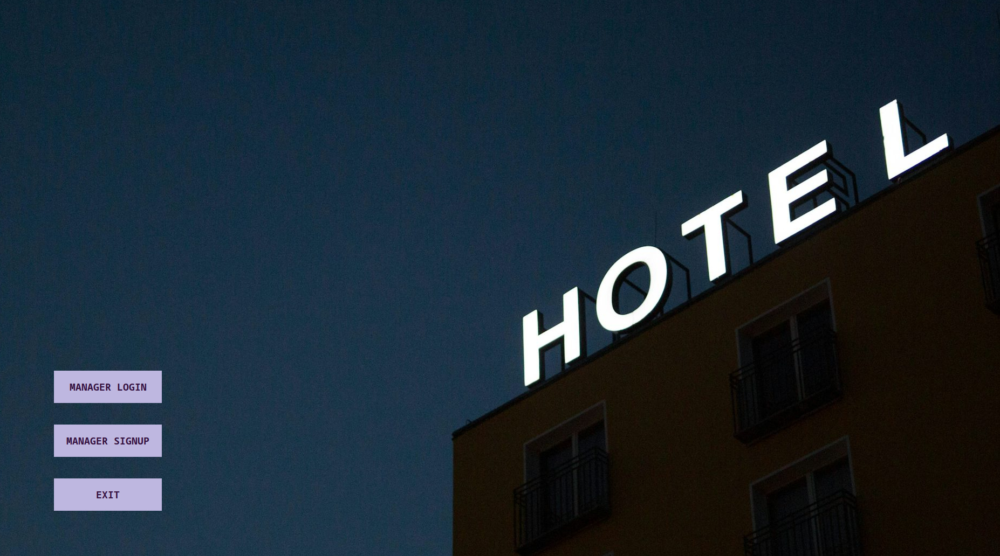
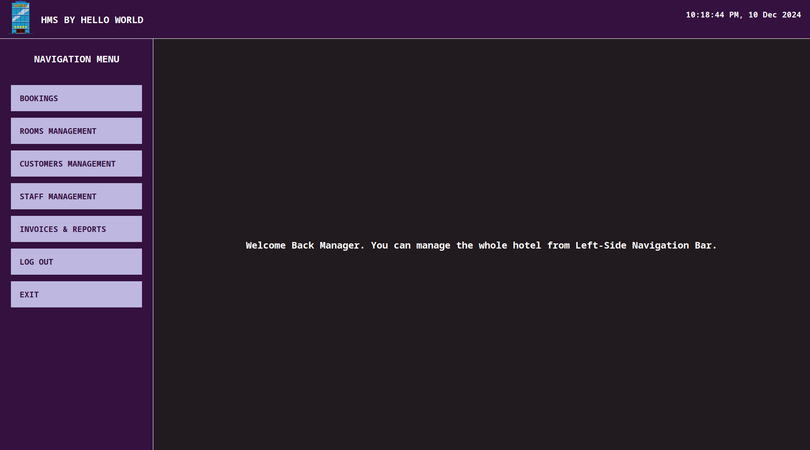
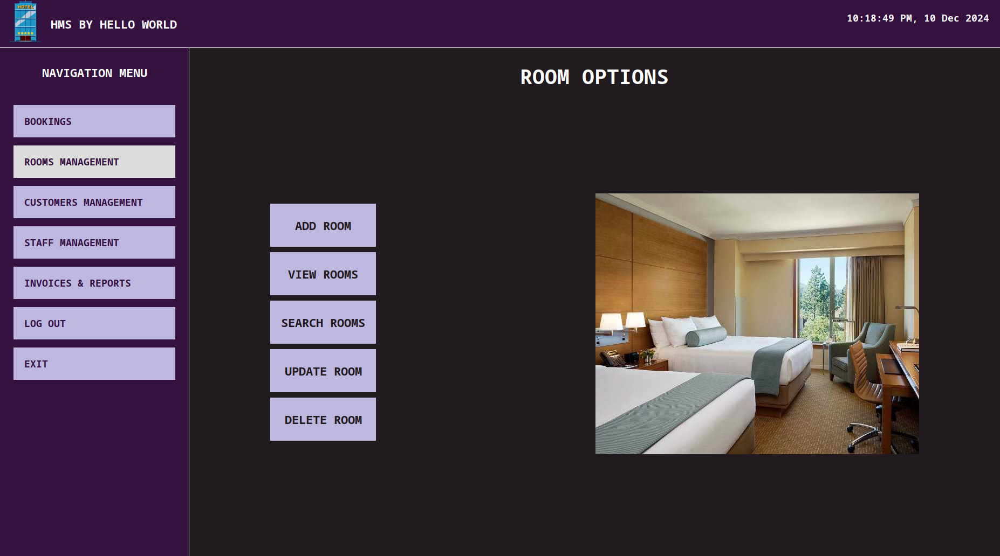
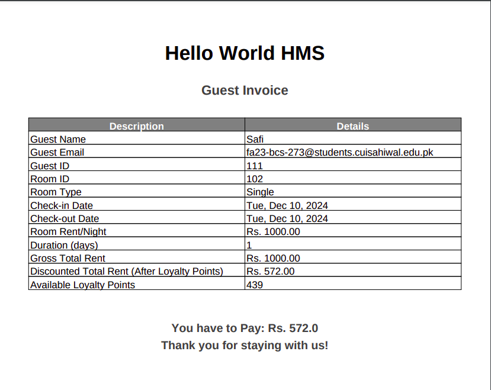
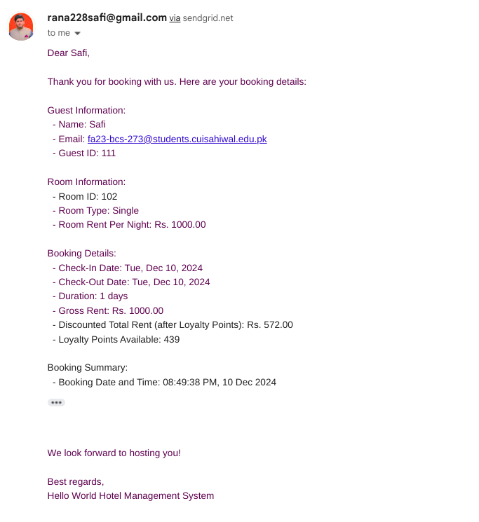

# Hotel Management System 
-  This project serves as my third semester Object-Oriented Programming (OOP) terminal project.

## Project Description
The **Hotel Management System** is a desktop application designed to help manage hotel operations efficiently. It is developed using **Java Swing** for the graphical user interface (GUI) and **MySQL** for backend database management. This system enables easy management of hotel resources like rooms, guests, staff, and billing, and includes the ability to generate and store invoices as PDFs. Additionally, the system integrates media files, including images and PDFs, within the executable JAR file.

## Features
- **Room Management**: Add, update, and delete room details, including availability and pricing.
- **Guest Management**: Manage guest profiles, booking details, and check-in/check-out status.
- **Staff Management**: Track staff roles, schedules, and payroll.
- **Billing System**: Generate bills for guests and store them as PDFs.
- **Database Integration**: Efficient data storage and retrieval using MySQL.
- **Media Integration**: Include images and PDFs within the JAR file for easy access.

## Technologies Used
- **Programming Language**: Java
- **GUI Framework**: Java Swing
- **Database**: MySQL
- **Development Environment**: IntelliJ IDEA
- **Version Control**: Git and GitHub

## Installation Instructions
Follow these steps to install and run the system:

1. **Clone the Repository**
   - Clone the project repository to your local machine using the following command:
     ```bash
     git clone https://github.com/safi-io/HotelManagementSystem.git
     ```

2. **Set Up Database**
   - Create a MySQL database and import the provided SQL schema to set up the necessary tables.
   - Update the database connection details in the configuration file.

3. **Build and Run**
   - Open the project in IntelliJ IDEA or your preferred Java IDE.
   - Build the project to generate the JAR file.
   - Execute the JAR file to start the application.

## Usage Instructions
- **Login Screen**: Enter your user credentials to access the system.
- **Main Dashboard**: Navigate through the different sections for room management, guest booking, staff management, and billing.
- **Generate Bills**: Use the billing section to generate and save guest invoices as PDFs.
- **Database Management**: View and modify hotel data as needed, using the integrated MySQL database.

## Screenshots
Here are some screenshots of the application in action:
- **Main Screen**
- **Main Dashboard**
- **Room Management Screen**
- **Invoice Generation**
- **E-mail Notifications**

## **Acknowledgments**
This project was developed as part of the **OOP Terminal Project** under the guidance of **Suhani** at **RGPV** for for the **Master of Computer Applications** program.  

## Contact
For any questions or support, feel free to reach out:

- **Developer**: Suhani Wadukle
- **Email**: suhaniwadukle@gmail.com
